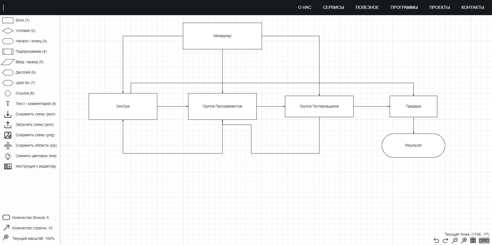

# homework-1.1.---Dmitry-Nemtsev
Домашнее задание лекция 1.1 Введение
Выполнил Немцев Дмитрий

## Задание 1
### Bash

### jsonnet

### markdown

### terraform

### yaml

## Задание 2
Второе задание. Так как в IT сфере я не работал, имея ввиду, где создают программы или сайты. Поэтому задание выполнил исходя из своего понимания.

